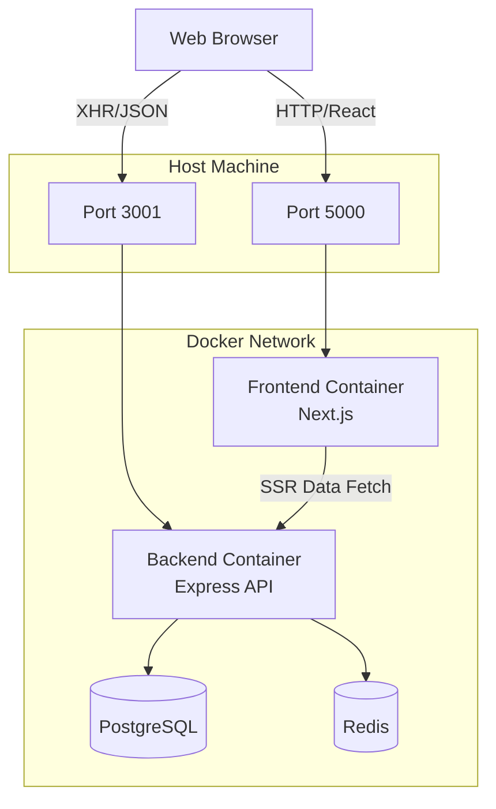

# System Architecture

## Component Diagram

## Authentication Flow

The system uses a **Dual-Token Strategy** for security:

1.  **Access Token (JWT)**
    *   **Storage**: Short-lived (15 min), stored in Frontend memory (React Context).
    *   **Usage**: Sent in `Authorization: Bearer <token>` header for API requests.
    *   **Purpose**: Access resources.

2.  **Refresh Token**
    *   **Storage**: Long-lived (7 days), stored in **HttpOnly, SameSite=Lax Cookie**.
    *   **Secure Flag**: Enabled in production (HTTPS). For LAN testing over HTTP, set `COOKIE_SECURE=false`.
    *   **Usage**: Sent automatically by the browser to `/auth/refresh` endpoint only.
    *   **Purpose**: obtain new Access Tokens without user interaction.

### Refresh Rotation
Every time a Refresh Token is used:
1.  The old token is deleted from the database.
    *   *Security*: If an attacker tries to reuse an old token, **Reuse Detection** triggers, and the user's entire session history is revoked.
2.  A new Refresh Token is issued and set in the cookie.

## Request Lifecycle

1.  **Request Arrival**: User sends request to `PORT 3001`.
2.  **Helmet & CORS**: Security headers and Origin checks run first.
3.  **Correlation ID**: A generic UUID is assigned (`X-Request-Correlation-ID`) for tracing.
4.  **Logging**: Request start is logged (Event: `request_start`).
5.  **Rate Limiter**: Redis checks IP-based limits.
6.  **Authentication (Optional)**: If the route is protected, JWT is verified.
7.  **Controller Logic**: Business logic executes (DB queries via Prisma).
8.  **Response**: JSON response sent.
9.  **Logging**: Request completion logged (Event: `request_end`) with duration.

## Data Persistence

*   **Primary Data**: Users, Articles, Settings are stored in PostgreSQL.
*   **Session State**: Revoked tokens (blacklist) and Rate Limit counters are stored in Redis (ephemeral).
